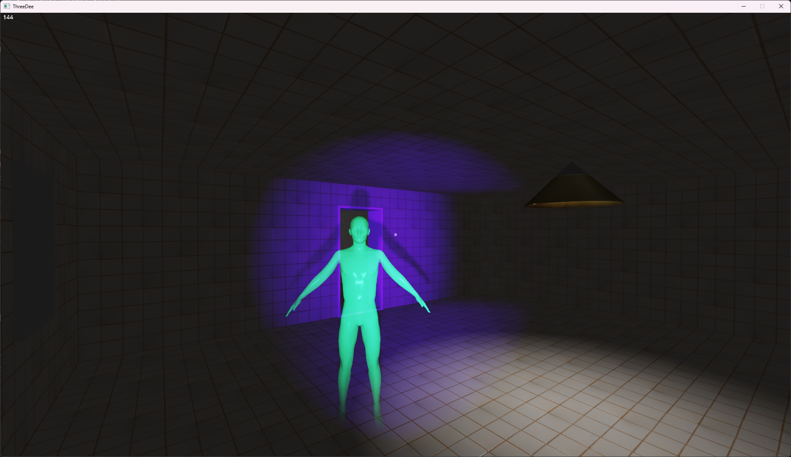

# README #

### What is this? ###
3D game prototype written "from scratch" using C and SDL3. Very much a work in progress.

### Features ###
* Entity-component-system architecture
* 3D rendering using SDL3 GPU interface
* Phong shading with multiple light sources
* Impulse-based collision resolution
    - Supported shapes: plane, sphere, cuboid, capsule, AABB
    - Supported collisions: 
        * sphere-plane
        * sphere-sphere 
        * sphere-cuboid 
        * cuboid-plane 
        * cuboid-cuboid (buggy)
        * capsule-plane
        * capsule-AABB
* Importing of 3D models in OBJ format (triangles only)
* Normal maps
* Emissive maps
* Dynamic shadows using shadow mapping
* HDR lighting
* Post-processing effects
    - Bloom
    - Depth of field
    - Tone mapping
* 2D and text rendering
* Sound effects
* Triple buffering
* Billboarding
* Spring constraints
* Particles
* Frustrum culling for lights

### TODO ###
* Data serialization for saving/loading game state
* PCSS for soft shadows?
* Skybox
* 3D audio using OpenAL
* Broad-phase collision detection for optimization
* Oren-Nayar diffuse shading
* Screen-space ambient occlusion (SSAO)
* Soft body physics

### How do I get set up? ###

MSVC:
* Install Visual Studio Build Tools 2022 with following components:
  - Desktop Development with C++
    * MSVC v143 - VS 2022 C++ x64/x86 build tools
    * Windows 11 SDK (10.0.19041.0)
    * C++ CMake tools for Windows
* Install glslangValidator (Comes with Vulkan SDK for example)
* Build the .exe:

    cmake . -B build -G "Visual Studio 17 2022" -A x64
    cd build
    cmake --build . --target install --config Release --parallel 8
