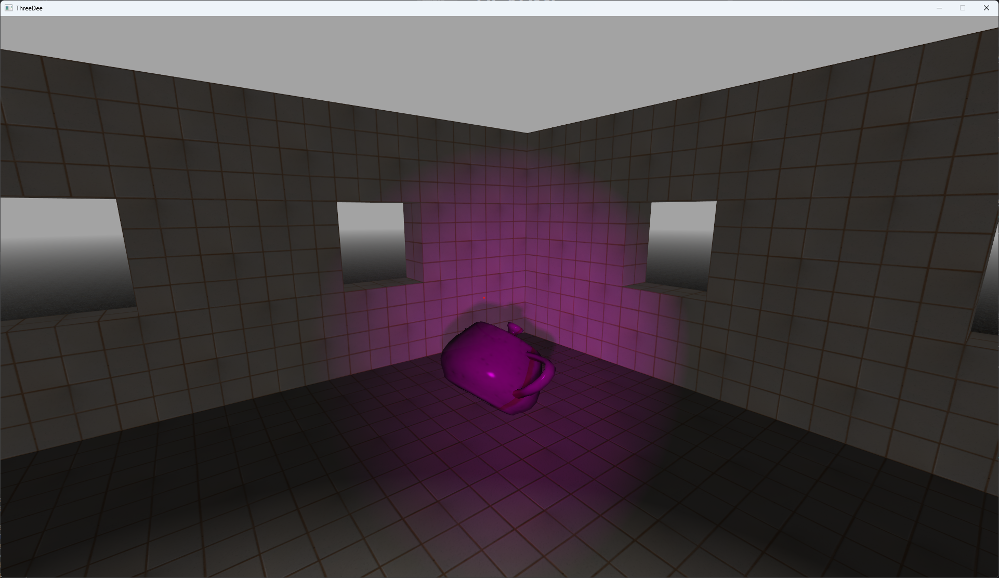

# README #

### What is this? ###
3D game prototype written "from scratch" using C and SDL3. Very much a work in progress.

### Features ###
* Entity-component-system architecture
* 3D rendering using SDL3 GPU interface
* Phong shading with multiple light sources
* Impulse-based collision resolution
    - Supported shapes: plane, sphere, cuboid, capsule, AABB
    - Supported collisions: sphere-plane, sphere-sphere, sphere-cuboid, cuboid-plane, cuboid-cuboid, capsule-AABB
* Importing of 3D models in OBJ format
* Normal maps
* Dynamic shadows using shadow mapping

### TODO ###
* 2D rendering
* Data serialization for saving/loading game state
* Particles
* Sound effects
* PCSS for soft shadows?
* Skybox

### How do I get set up? ###

MSVC:
* cmake . -B build -G "Visual Studio 17 2022" -A x64
* cd build
* cmake --build . --target install --config Release
